# EcommerceApp

---

## 🎬 Demo Video

[Watch Demo](https://drive.google.com/drive/folders/1zIc-Z_eRD2gSSAFNdqoGgaSoYHruaK3Q)

---
## 📸 UI Snapshots

### 🔐 Authentication

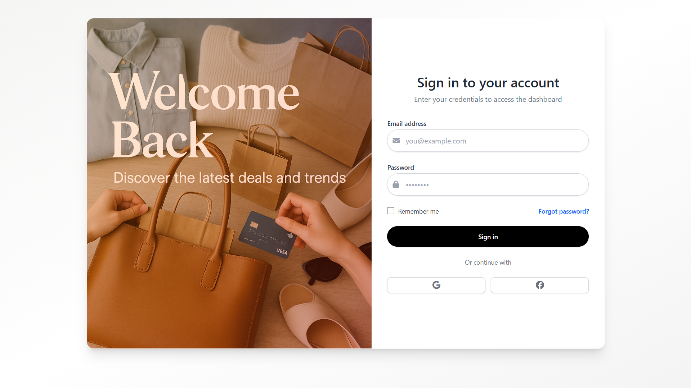  
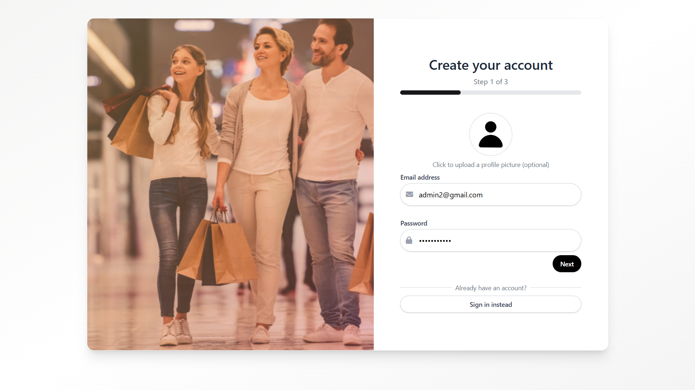  
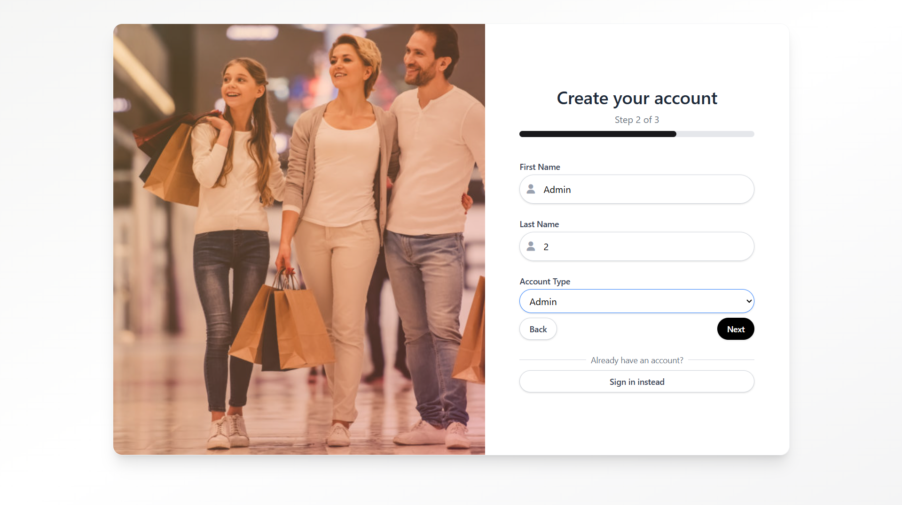  
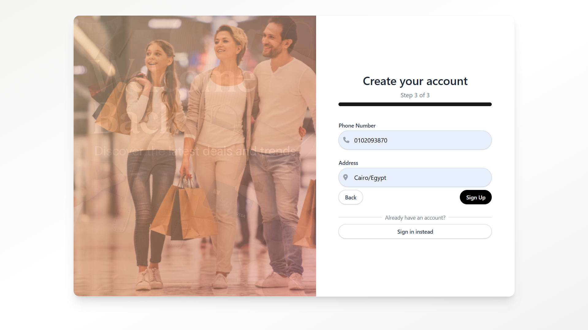  

---

### 🏠 Home

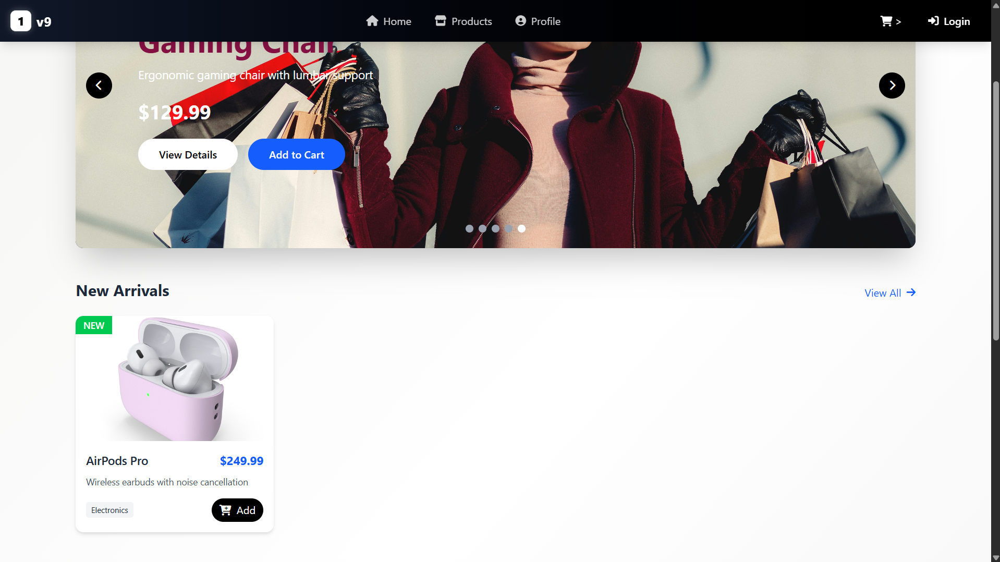

---

### 🛍️ User Panel

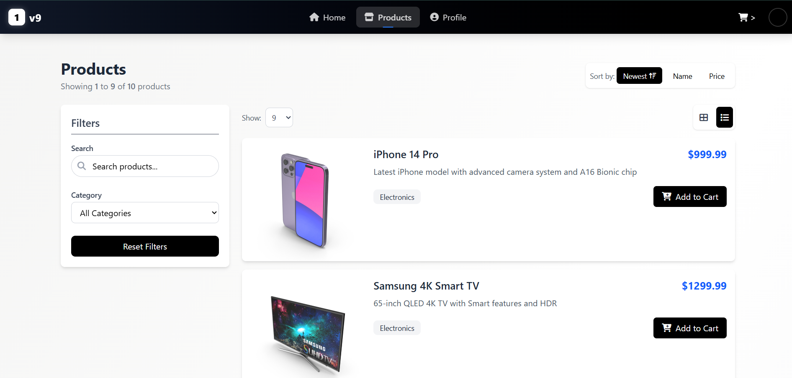  
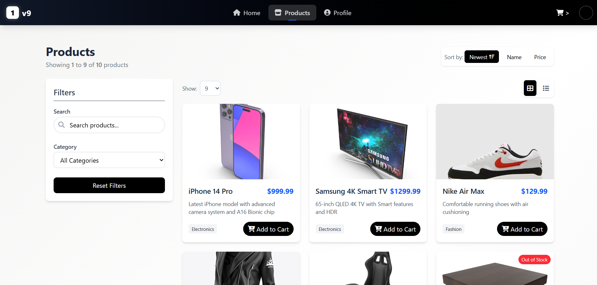  
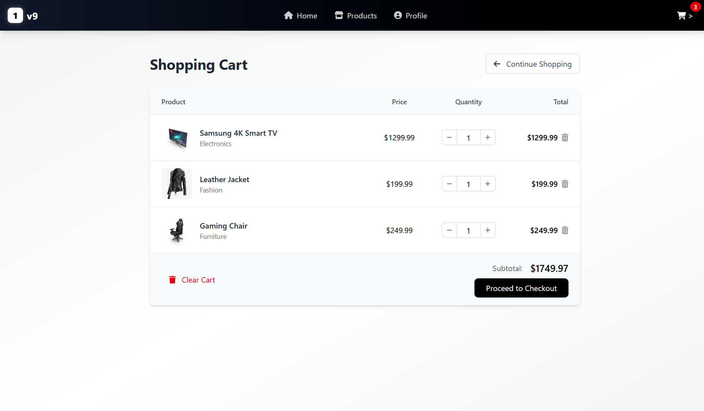  
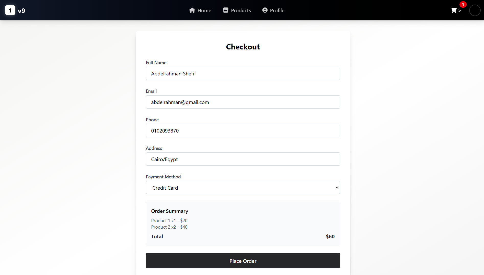  
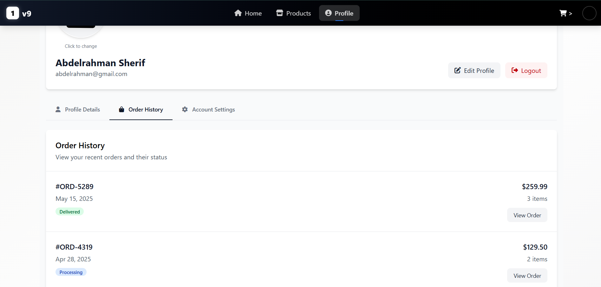  
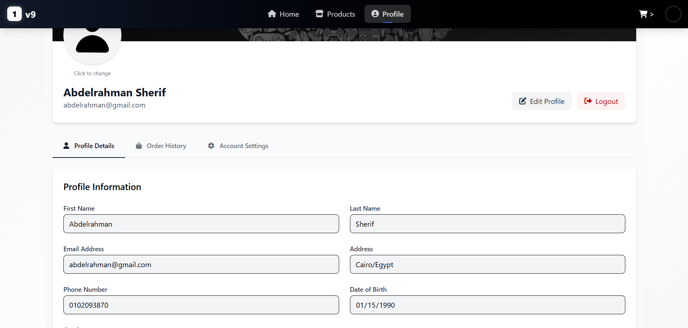  

---

### 🛠️ Admin Panel

  
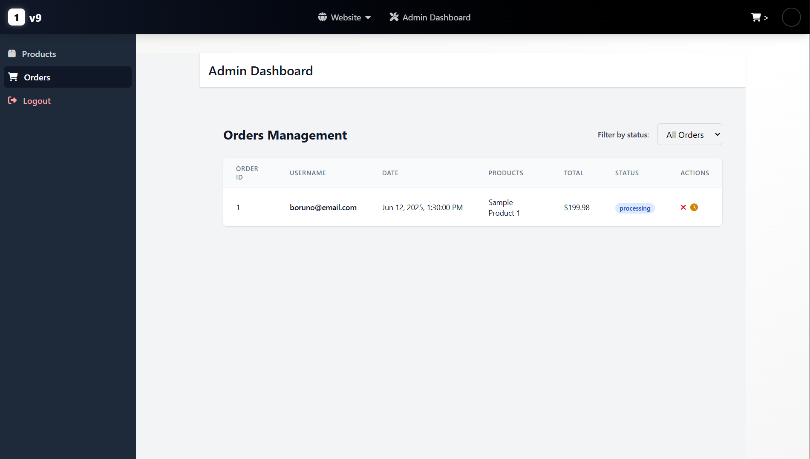  
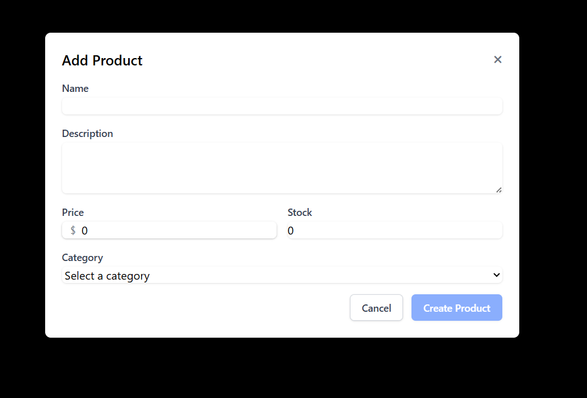  
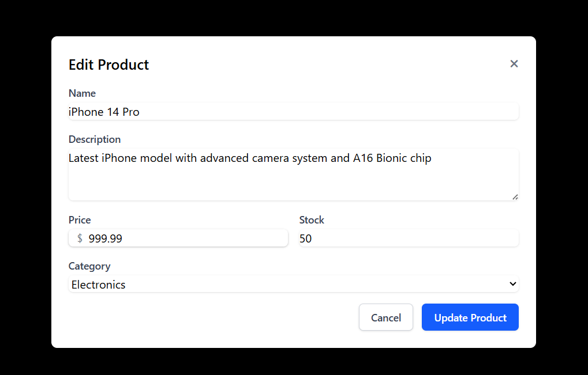  
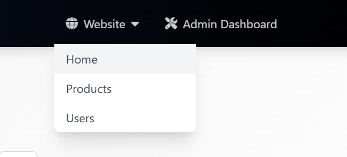  

---

### 📭 Empty States

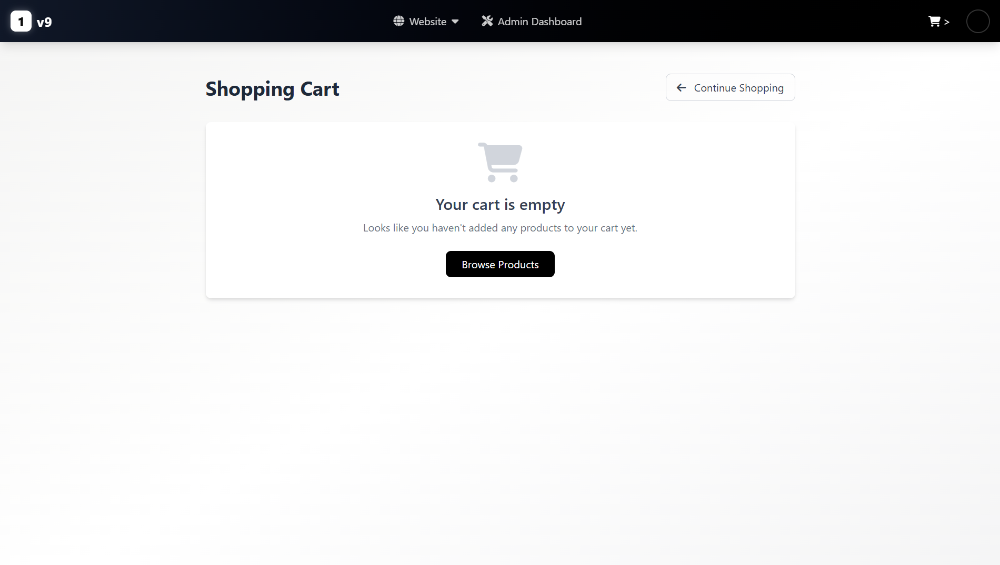

---

This project was generated using [Angular CLI](https://github.com/angular/angular-cli) version 19.2.7.

---

## 🚀 Development Server

To start the local development server, run:

```bash
ng serve
